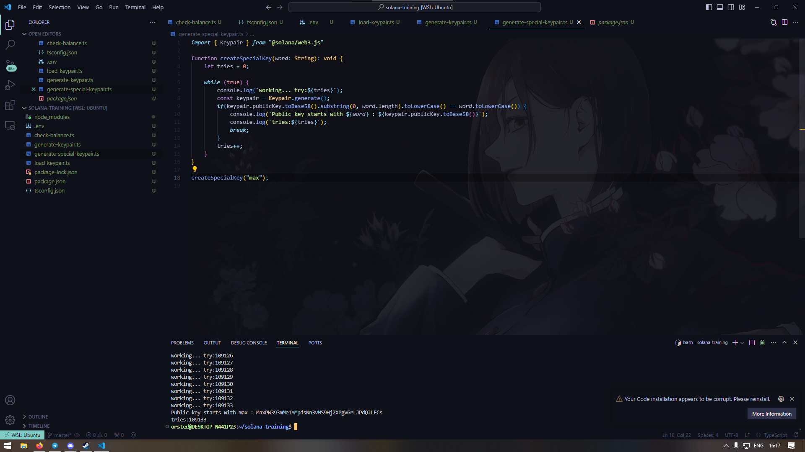

# CreateSpecialKey

Підбір ключів я реалізував як функцію, яку, фактично, можно використовувати у коді. \
За допомогою циклу воно підбирає ключ, який починається з слова, який поклали у функцію. \
Забиває на регістр, бо буде дуже довго шукати.

